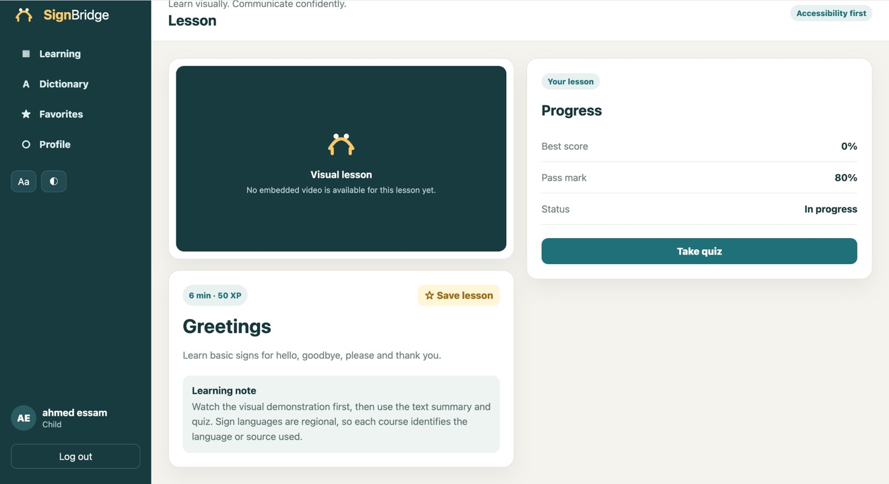

# SignBridge

<p align="center">
  <strong>A full-stack visual learning platform for children, parents, teachers, and administrators.</strong>
</p>

<p align="center">
  
  
  
  
  
  
  
</p>

<p align="center">
  <a href="https://github.com/ahmedessam58800-jpg/Signbridge/actions">
    
  </a>
</p>

---

## Overview

**SignBridge** is a portfolio-grade learning platform built with **ASP.NET Core + Angular**.

It supports four roles:

- **Child** — courses, lessons, embedded videos, quizzes, XP, streaks, favorites, achievements, dictionary, profile.
- **Parent** — link children and follow learning progress.
- **Teacher** — create and manage courses, levels, lessons, quizzes, and questions.
- **Admin** — platform statistics, user management, and content administration.

The project goes beyond basic CRUD by including authentication, authorization, learning rules, sequential lesson unlocking, parent-child security, progress tracking, media lessons, and a responsive accessible UI.

## Screenshot

<p align="center">
  
</p>

## Main features

- Email/password authentication
- JWT access tokens + refresh tokens
- Role-based authorization
- Child and Parent self-registration
- Teacher/Admin controlled content management
- Video-backed lessons
- Sequential lesson unlocking
- Quizzes with passing scores
- XP and streak tracking
- Favorites and achievements
- English/Arabic sign dictionary
- Parent-child linking using email + private code
- Parent progress dashboard
- Admin analytics and account enable/disable
- Responsive Angular UI
- Large-text and high-contrast accessibility controls
- SQLite local database
- PostgreSQL support
- OpenAPI
- xUnit tests
- GitHub Actions CI

## Course library

The seeded learning library includes:

- **Arabic Alphabet — Visual Learning**
- **English Alphabet in ASL**
- **Numbers in ASL**
- **School & Colors in ASL**
- **Family Signs in ASL**
- **Math Basics in Sign Language**

> Sign languages are regional. External lesson sources identify the sign-language context used. General Arabic literacy content is not presented as Arabic Sign Language.

## Tech stack

| Layer | Technology |
|---|---|
| Frontend | Angular 20, standalone components, Angular Router, HttpClient |
| Backend | .NET 10, ASP.NET Core Web API |
| ORM | Entity Framework Core 10 |
| Authentication | JWT + refresh tokens |
| Database | SQLite / PostgreSQL |
| Testing | xUnit |
| API docs | OpenAPI |
| DevOps | Docker, GitHub Actions |

## Architecture

```text
SignBridge/
├── frontend/
│   └── Angular application
├── src/
│   ├── SignBridge.Api
│   ├── SignBridge.Application
│   ├── SignBridge.Domain
│   └── SignBridge.Infrastructure
├── tests/
│   └── SignBridge.UnitTests
├── docs/
│   ├── ARCHITECTURE.md
│   └── screenshots/
├── .github/
│   └── workflows/
│       └── ci.yml
├── Dockerfile
├── docker-compose.yml
└── SignBridge.sln
```

### Request flow

```text
Angular UI
   ↓
Auth interceptor / Route guards
   ↓
ASP.NET Core API
   ↓
Application services
   ↓
Infrastructure / EF Core
   ↓
SQLite or PostgreSQL
```

## Important business rules

- Lessons are sequential inside each level.
- Locked lessons cannot be bypassed through direct API calls.
- A lesson is completed only after the quiz passing score is reached.
- XP is awarded only on first successful completion.
- Parent progress endpoints verify the parent-child relationship.
- Public registration cannot create Teacher or Admin accounts.
- Refresh tokens are persisted as hashes.

## Local reviewer accounts

| Role | Email | Password |
|---|---|---|
| Child | `child@signbridge.local` | `Child123!` |
| Parent | `parent@signbridge.local` | `Parent123!` |
| Teacher | `teacher@signbridge.local` | `Teacher123!` |
| Admin | `admin@signbridge.local` | `Admin123!` |

The seeded Parent account is already linked to the seeded Child account.

## Run locally

### Backend

```bash
dotnet restore
dotnet build
dotnet run --project src/SignBridge.Api --urls http://localhost:5187
```

Health check:

```text
http://localhost:5187/api/system/health
```

OpenAPI:

```text
http://localhost:5187/openapi/v1.json
```

### Frontend

```bash
cd frontend
npm install
npm start
```

Open:

```text
http://localhost:4200
```

## Tests

Backend:

```bash
dotnet test
```

Frontend production build:

```bash
cd frontend
npm run build
```

## PostgreSQL

SQLite is the default for quick local review.

To use PostgreSQL:

```bash
docker compose up -d db
```

Then configure:

```text
Database__Provider=Postgres
ConnectionStrings__Postgres=Host=localhost;Port=5432;Database=signbridge;Username=postgres;Password=postgres
```

## Video content note

The project can embed external educational videos and also supports uploaded media.

For a production educational deployment, curriculum, sign-language variants, and media usage should be reviewed by qualified Deaf/sign-language educators and should comply with the source platform's terms and permissions.

## Future production improvements

- Object storage/CDN for media
- Email verification and password reset
- Production EF Core migrations
- Rate limiting
- Stronger audit logging
- Integration/E2E test coverage
- Monitoring and observability
- Reviewed regional sign-language curriculum
